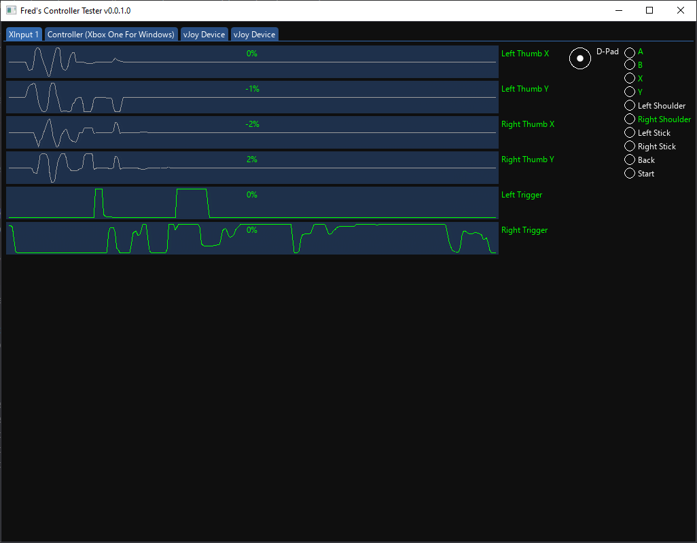
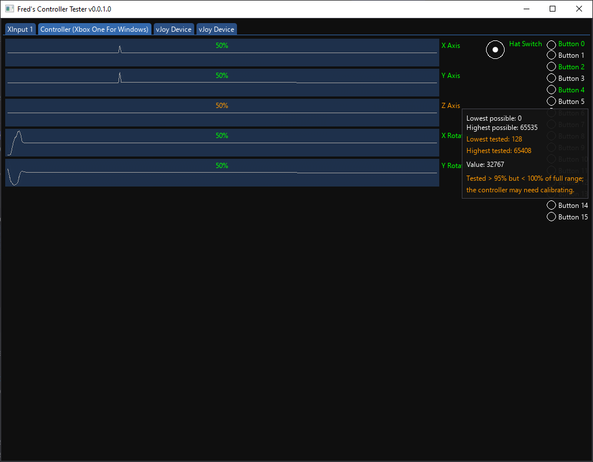
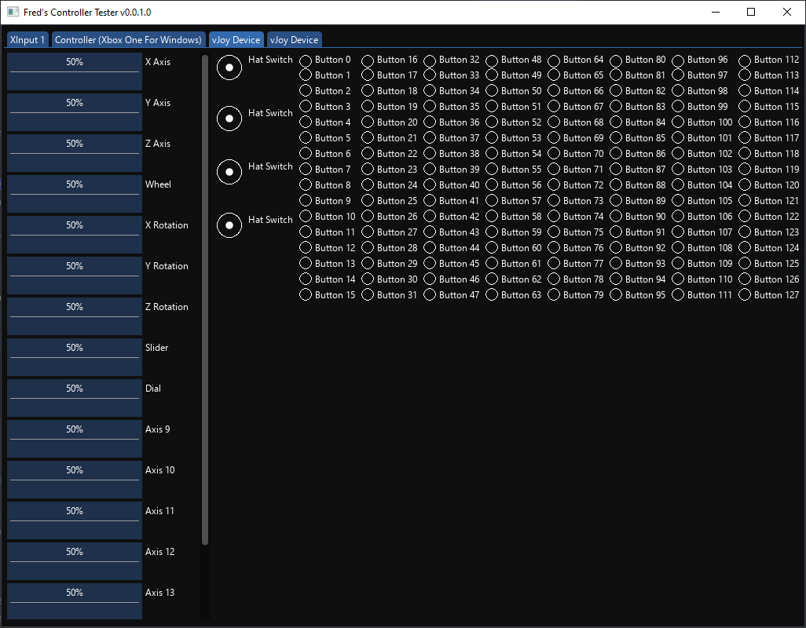

# Fred's Controller Tester

A DirectInput and XInput tester.

- XInput-compatible pads can be tested with both DirectInput *and* XInput
- It handles *any number* of axes, buttons, or hats. Yes, it can handle 128, yes, it can handle even more.
- It handles multiple devices with the same name, or the same USB VID/PID (e.g. multiple vJoy devices)
- It supports handles devices with unusual combinations of axes and buttons (e.g. handbrakes with 1 axis and no buttons, or controllers with only buttons)
- It works with any manufacturer's device
- It can be used to test axis range

## Colors

- green: the full input range is being tested
- orange: most of the input range has been tested, but not quite all; this can indicate a calibration error
- blue: input is detected

## Control Names

This tester shows the axis/button/hat names reported by Windows or the driver; most games ignore these, and it is normal for them to seem incorrect; for example, a clutch might be shown as 'Combined Pedals', even if there is another axis labelled 'Clutch'. This is not a bug, and not anything to worry about.

## Getting Started

1. Download [the latest release](https://github.com/fredemmott/Freds-Controller-Tester/releases/latest)
2. Extract the zip somewhere handy
3. Run the exe!

## Screenshots

## Getting Help

Help may be available from the community on [my Discord](https://go.fredemmott.com/discord).

## License

This software is licensed under the ISC license (below); the icon is licensed under the Apache License v2.0.

See [LICENSE](LICENSE) and [icon/LICENSE](icon/LICENSE) for details.

---

Copyright (c) 2023 Fred Emmott.

Permission to use, copy, modify, and/or distribute this software for any purpose
with or without fee is hereby granted, provided that the above copyright notice
and this permission notice appear in all copies.

THE SOFTWARE IS PROVIDED “AS IS” AND THE AUTHOR DISCLAIMS ALL WARRANTIES WITH
REGARD TO THIS SOFTWARE INCLUDING ALL IMPLIED WARRANTIES OF MERCHANTABILITY AND
FITNESS. IN NO EVENT SHALL THE AUTHOR BE LIABLE FOR ANY SPECIAL, DIRECT,
INDIRECT, OR CONSEQUENTIAL DAMAGES OR ANY DAMAGES WHATSOEVER RESULTING FROM LOSS
OF USE, DATA OR PROFITS, WHETHER IN AN ACTION OF CONTRACT, NEGLIGENCE OR OTHER
TORTIOUS ACTION, ARISING OUT OF OR IN CONNECTION WITH THE USE OR PERFORMANCE OF
THIS SOFTWARE.